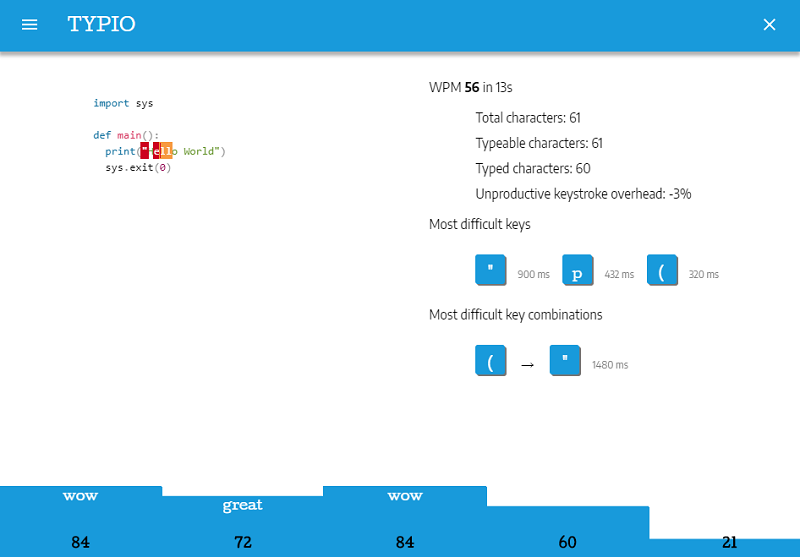

# \<typio\>

Practice deliberately touch typing.


**Important**: This project is under development. You could access the latest version at: [https://typio-59500.firebaseapp.com/](https://typio-59500.firebaseapp.com/)


## Presentation

*Typio* is a web editor to practice touch typing on various types of content:

* Source code using famous projects hosted by GitHub (Docker, Linux, Git, Hadoop, etc.). All major programming languages are represented: JavaScript, Java, C, C++, Python, PHP, Ruby, Shell, C#, Go, Swift, Scala, Haskell, Lua, Clojure, Rust, Erlang, and many others.

* Classic literature using Public Domain books hosted by Project Gutenberg. For now, only latin-based languages are supported: English, French, German, Spanish, Italian, Portuguese, and many others.

* Other sources are planned in a new future: lyrics, quotations, etc.

Here is a preview of the editor:




## Motivations


*TypeRacer* is excellent to compete with other typists but do not help you to identify your weaknesses and work specifically on it. To reach expert performance, research reveals we need to practice on the hardest parts (see [deliberate practice][dp]). The aim of *Typio* is to help you focus on these most challenging aspects. After each practice session, the editor reveals statistics (WPM, unproductive keystroke overhead, most difficult keys, etc.). While not currently implemented, *Typio* will let you create your own drills based on the hardest key combinations to practice specifically on your weaknesses. So, *Typio* is the perfect complement to practice alone before competing on *TypeRacer*.


## Install

The application uses the [Polymer 2.0](https://www.polymer-project.org/) framework. While not the most popular web framework, Polymer embraces web standards and requires minimal rewrites between versions (a good point for a side project.)

To install the application on your machine, make sure you have the [Polymer CLI](https://www.npmjs.com/package/polymer-cli) installed. Then run `polymer serve` to serve the application locally.

Then, follow the URL displayed on the output.

## Building

```
$ polymer build
```

This will create builds of your application in the `build/` directory, optimized to be served in production. 

By default, GitHub project resources (under `/content/github/`) are not copied. You need to run the scripts `python link-content.py`. This script only copies enabled projects (useful to limit the space consumption on Firebase Hosting.)

You can then serve the built versions by giving `polymer serve` a folder to serve from:

```
$ polymer serve build/default
```

## Deploying

The application is deployed on Firebase Hosting. To deploy the application, you need to install the Firebase CLI first. Then, run `firebase deploy`. 

Check the [complete procedure](https://firebase.google.com/docs/hosting/deploying) for more information.

Note: If this is the first time you deploy, you need to configure the Firebase application using the command `firebase init`.


## Running Tests

Polymer uses [web-component-tester](https://github.com/Polymer/web-component-tester). To run the tests, run `polymer test`.

```
$ polymer test
```

## Managing the catalog

A CLI is provided to manage the catalog. To use it, you need Python 3 and have virtualenv installed on your machine (see https://packaging.python.org/guides/installing-using-pip-and-virtualenv/ for install details). In summary:

```
$ python3 -V
Python 3.6.3

$ sudo apt-get install python-dev and python3-dev
$ sudo apt-get install python-pip
$ sudo apt-get install virtualenv
```

Once `virtualenv` is installed, you can create a new environment and install CLI dependencies:

```
$ virtualenv -p /usr/bin/python3 env

$ source env/bin/activate
$ pip install -r requirements.txt
...
$ deactivate
```

To launch the CLI, run the executable `typio`.


[dp]: https://en.wikipedia.org/wiki/Practice_(learning_method)#Deliberate_practice
